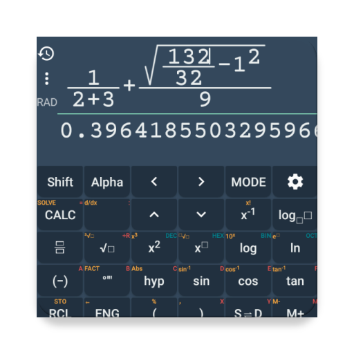

# NCalc+
Powerful calculator for Android.

Get lite version in Google Play Store

## How to build and run this source

1. Clone project by using Android Studio
2. Select and build module **app**

## ALGEBRA

	1. Computer science
	2. Solving the equation:
	3. Solve system equations
	4. Graphing
	5. Cartesian geometry sand(Viet Nam Education)
	6. Unit Conversions
	8. Simplify expressions
	9. Polynomial factorization.
	10. Binomial expansion Newton
	11. Matrix

## ANALYTICS

	1. Derivative
	2. Antiderivative
	3. Definite integrals
	4. Find the limit of the sequence, function

## TRIGONOMETRIC

	1. Trigonometric expand: sin(2x) -> 2sin(x)cos(x)
	2. Trigonometric reduce: 2sin(x)cos(x) -> sin(2x)
	3. Trigonometric to exponent: sinh(x) -> (e^x-e^(-x))/2

## DETERMINATION OF STATISTICS

	1. Combination
	2. Permutation

## SOME OTHER FEATURES

	1. Prime factors
	2. Modulo
	3. Catalan number
	4. Fibonacci number
	5. Pi number

## Note

The Calculator does not show the steps to solve the equations, system of equations, derivative... but only for the final result.
Enter sin(30°) to calculate sine Degree mode

The computer can work in two modes:
- 	Decimal mode: 0.12312312323
- 	Mode fractions: for results with arbitrary precision, for example 9^99999

Fanpage application support: https://www.facebook.com/calculator.n.plus/

Any suggestions on the application please send mail: Tranleduy1233@gmail.com.

## Install Natural Keyboard for input math formula

https://play.google.com/store/apps/details?id=com.duy.calc.casio

## License

	Copyright 2017 Tran Le Duy

	Licensed under the Apache License, Version 2.0 (the "License");
	you may not use this file except in compliance with the License.
	You may obtain a copy of the License at

		http://www.apache.org/licenses/LICENSE-2.0

	Unless required by applicable law or agreed to in writing, software
	distributed under the License is distributed on an "AS IS" BASIS,
	WITHOUT WARRANTIES OR CONDITIONS OF ANY KIND, either express or implied.
	See the License for the specific language governing permissions and
	limitations under the License.