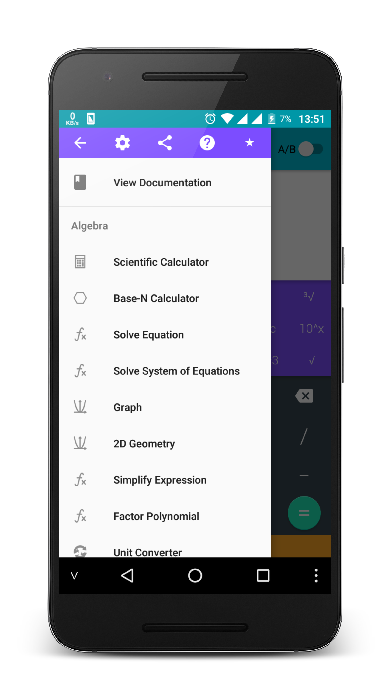
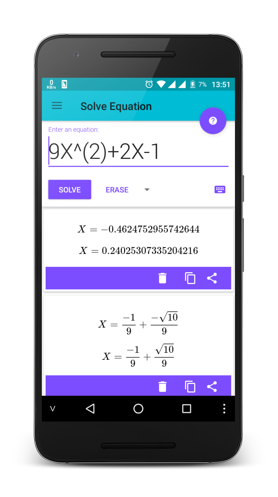

# Calculator N+ - Powerful calculator for Android.
I am no longer supported the development of this project, pull request are welcome.

## Overview
This is a powerful android calculator that contains most of the features needed. The power of the application is through the use of the Symja library. The results are displayed by Latex technology. The application is designed as material design. This project is an open source project that allows people to study, ad-free application.

Get lite version in Google Play Store

## How to build this source by using Android Studio

1. Clone project, Select ``File``->``New``->``Project from Version Control``->``GitHub``
2. Select and build module **app**

## Screenshot

 

## ALGEBRA

	1. Computer science
	2. Solving the equation:
	3. Solve system equations
	4. Graphing
	6. Unit Conversions
	8. Simplify expressions
	9. Polynomial factorization.
	10. Binomial expansion Newton
	11. Matrix

## ANALYTICS

	1. Derivative
	2. Antiderivative
	3. Definite integrals
	4. Find the limit of the sequence, function

## TRIGONOMETRIC

	1. Trigonometric expand: sin(2x) -> 2sin(x)cos(x)
	2. Trigonometric reduce: 2sin(x)cos(x) -> sin(2x)
	3. Trigonometric to exponent: sinh(x) -> (e^x-e^(-x))/2

## DETERMINATION OF STATISTICS

	1. Combination
	2. Permutation

## SOME OTHER FEATURES

	1. Prime factors
	2. Modulo
	3. Catalan number
	4. Fibonacci number
	5. Pi number

## Note

The Calculator does not show the steps to solve the equations, system of equations, derivative... but only for the final result.
Enter sin(30°) to calculate sine Degree mode

The computer can work in two modes:
- 	Decimal mode: 0.12312312323
- 	Mode fractions: for results with arbitrary precision, for example 9^99999

## License GNU GPL 3.0
### Any user re-publish this app on Google Play without open source project will be reported.

	Copyright 2017 Tran Le Duy

    This program is free software: you can redistribute it and/or modify
    it under the terms of the GNU General Public License as published by
    the Free Software Foundation, either version 3 of the License, or
    (at your option) any later version.

    This program is distributed in the hope that it will be useful,
    but WITHOUT ANY WARRANTY; without even the implied warranty of
    MERCHANTABILITY or FITNESS FOR A PARTICULAR PURPOSE.  See the
    GNU General Public License for more details.

    You should have received a copy of the GNU General Public License
    along with this program.  If not, see <http://www.gnu.org/licenses/>.
